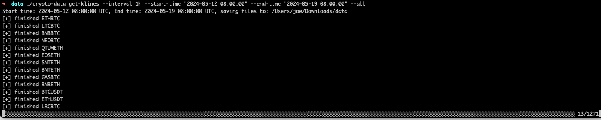
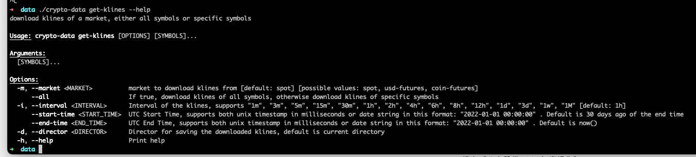
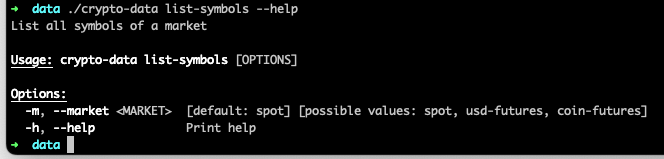

# Crypto Data Downloader

Download historical data for cryptocurrencies from binance.

## Features:
1. List all symbols for spot market, usd futures and coin futures.
2. Download historical data for specific symbols or all symbols.


   
   

   


   

## How to use:
1. Download crypto-data binary from [releases](https://github.com/cckn1ght/crypto-data/releases/tag/v1)
2. Grant execute permission to the binary:

```$ chmod +x crypto-data```

3. Run the binary:

```$ ./crypto-data --help```

4. If MacOS blocks the binary, you can unblock it by running:

 ```$ xattr -d com.apple.quarantine crypto-data```

5. Most simple usage:

```$ ./crypto-data get-klines --all```

## Detailed Usage:
1. There are two major commands: `list-symbols` and `get-klines`
2. You can get all the symbols by running `$ ./crypto-data list-symbols` for spot market symbols or `$ ./crypto-data list-symbols -m usd-futures` for usd futures and `$ ./crypto-data list-symbols -m coin-futures` for coin futures. Run `$ ./crypto-data list-symbols --help` for more information.
3. To download historical data for specific symbols, run `$ ./crypto-data get-klines <symbols>`. For example: `$ ./crypto-data get-klines --market coin-futures --interval 1h --start-time "2024-05-12 08:00:00" --end-time "2024-05-19 08:00:00" ETHUSD_240927 DOTUSD_PERP`
4. To download for all symbols, run `$ ./crypto-data get-klines --market spot --interval 1h --start-time "2024-05-12 08:00:00" --end-time "2024-05-19 08:00:00" --all`
5. Run `$ ./crypto-data --help ` or `$ ./crypto-data get-klines --help` or `$ ./crypto-data list-symbols --help` for detailed information.
6. To run the binary behind proxy, you can set the environment variable `HTTP_PROXY` and `HTTPS_PROXY` to the proxy address. For example: `export https_proxy=http://127.0.0.1:7897 http_proxy=http://127.0.0.1:7897 all_proxy=socks5://127.0.0.1:7897`